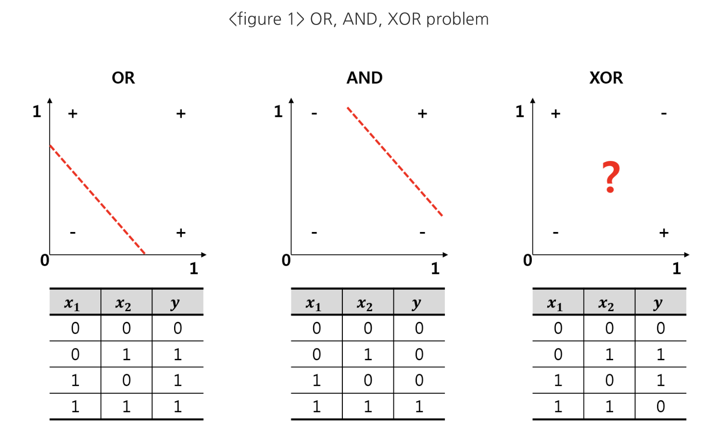

# [강승태 석사님 수업](code_1121.ipynb)

## XOR 문제란?

**XOR 문제**란 위 그림에 나타난 것 처럼   
**linear 방식으로 데이터를 구분할 수 없는 문제**를 말합니다.  
OR 문제나 AND 문제는 아래와 같이 직선을 활용하여   
데이터를 명확하게 구분할 수 있지만,   
XOR 문제는 어떤 직선을 활용하더라도 + 와 – 를 구분할 수 없습니다.

Minsky(1969)에서는 XOR 문제를 해결할 수 있는 대안으로   
MLP(Multi-Layer Perceptrons)에 대한 개념,   
즉, 현재 우리가 알고 있는 일반적인 인공 신경망을 소개했지만,   
Hidden layer의 weight와 bias에 대한 학습이 불가능하다는 증명을 하면서     
Neural Network에 대한 연구가 한동한 지체되기도 했습니다.   
**딥러닝 완전 망할뻔함..**
그러나 Hinton(1986)에서 Neural Network에서의   
weight와 bias를 학습시킬 수 있는 Backpropagation에 대한 개념을 소개하면서,  
다시 Neural network에 대한 연구가 활발해졌습니다.  

더 궁금하다면 아래의 블로그를 찾아봅시다

* [딥러닝과 XOR 문제](https://nyanye.com/machine-learning/2017/01/22/XOR-Problem/)
* [딥러닝의 기본 개념- 시작과 XOR 문제 (lec 08-1)](http://pythonkim.tistory.com/31)
* [XOR 문제와 Neural Network](http://www.birc.co.kr/2018/01/22/xor-%EB%AC%B8%EC%A0%9C%EC%99%80-neural-network/)
* [XOR 비트 연산 - 칸 아카데미](https://ko.khanacademy.org/computing/computer-science/cryptography/ciphers/a/xor-bitwise-operation)

## 학습한 데이터를 저장했다 다시 불러와보기
[데이터](wine.csv)를 이용해 학습하고 여러 변화를 주며 코드를 돌려봅시다 